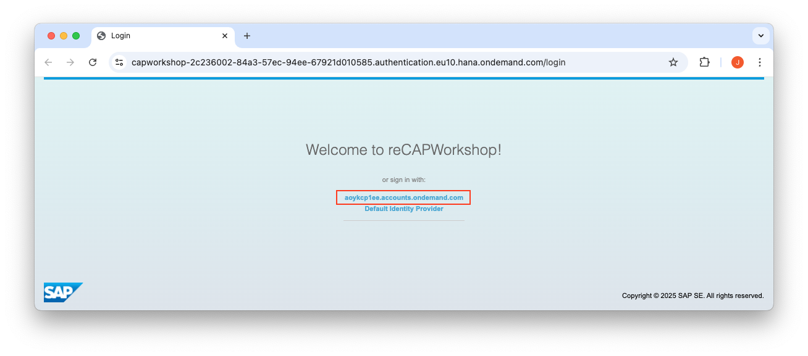
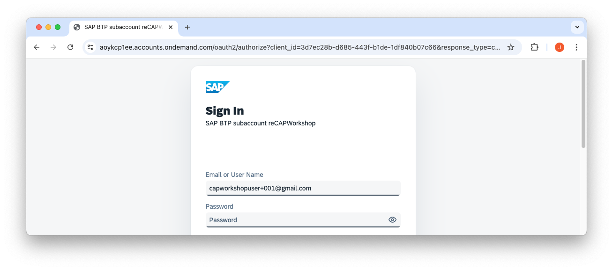
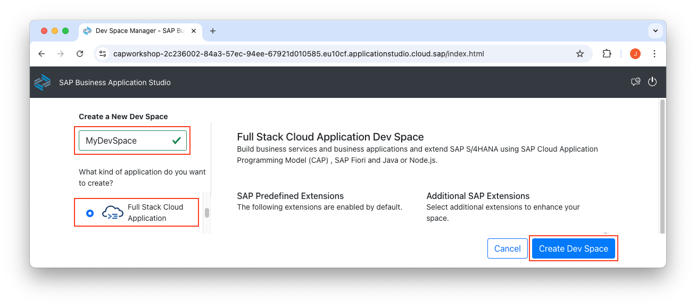
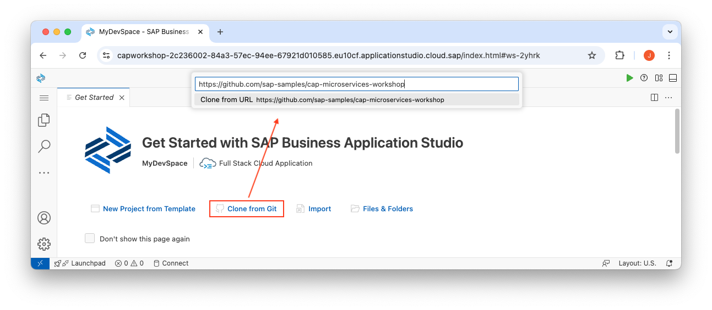
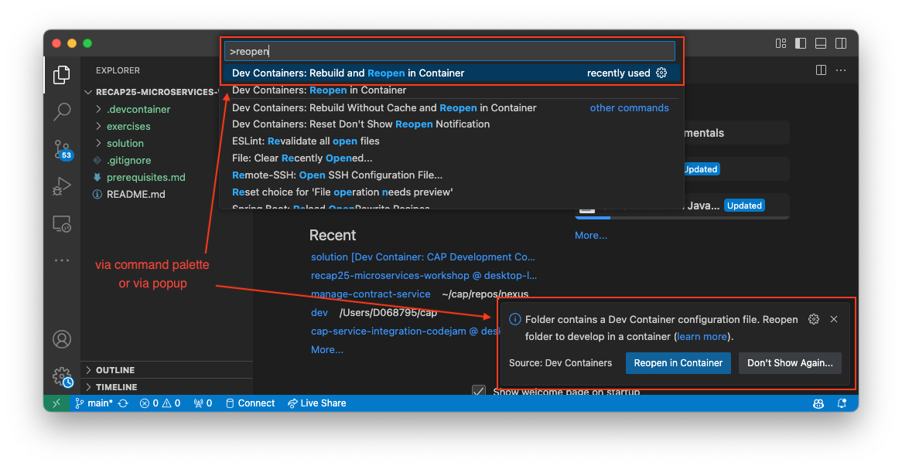

# Exercise 00 - Set up your workspace

At the end of this exercise, you'll have an environment in which to work for the duration of this workshop, and the contents of this repository loaded and ready to use.

## Set up the environment and clone this repository

To follow this workshop, you'll need the repository and a few command line tools, provided as part of an environment. Your workspace is either going to be a Dev Space in the SAP Business Application Studio (the "primary environment"), or VS Code with a dev container (the "alternative environment").

Follow one of the two subsections here, as appropriate: either for a [primary environment](#primary-environment-a-dev-space-in-the-sap-business-application-studio) or for an [alternative environment](#alternative-environment-vs-code-and-a-container-image).


### Primary environment: A Dev Space in the SAP Business Application Studio

_Follow the "Alternative environment" subsection below if you want to use VS Code and a container image._


#### Login to SAP Business Application Studio

For [re>≡CAP 2025](https://recap-conf.dev/) we have prepared a BTP Subaccount you can use. If you work through this on your own, you can use a BTP trial account.

👉 Login to BAS:
https://capworkshop-2c236002-84a3-57ec-94ee-67921d010585.eu10cf.applicationstudio.cloud.sap/

Select `aoykcp1ee.accounts.ondemand.com` on the Login screen:


User: capworkshopuser+0xx@gmail.com (001 ... 040 is the range)  
Password: *** (shared in Workshop)



> Incognito mode is your friend. In case you get logged in using your regular user, use incognito mode or clear your browser cookies.

#### Create a BAS Dev Space



Choosing the "Full Stack Cloud Application" brings in some predefined extensions, as you can see from the screenshot, including a CDS Graphical Modeler and the CAP Tools.

> You may need to stop existing Dev Spaces to use this one, depending on your subscription access.

#### Clone the repository

👉 Once the Dev Space is started and you're in it, use the "Clone from Git" option in the "Get Started" screen that appears, to clone this repository. In the subsequent prompt enter https://github.com/sap-samples/cap-microservices-workshop as the URL.



### Alternative Environment: VS Code and a container image

_Follow the "Primary environment" section above if you want to use a Dev Space in the SAP Business Application Studio._

#### Clone the repository

👉 At a command prompt on your local machine, clone this repository into a directory of your choice, and then open VS Code, pointing to that newly cloned repository's directory:

```sh
git clone https://github.com/sap-samples/cap-microservices-workshop
code cap-microservices-workshop
```

#### Reopen in Container

👉 Once VSCode opens the folder, you get a popup to reopen it in a container. If this popup does not appear, you can reopen in container via the [command palette](https://docs.github.com/en/codespaces/reference/using-the-vs-code-command-palette-in-codespaces)



> If the option to reopen in a container is not available, make sure that you have installed the Dev Containers extension in VSCode.

[Dev containers](https://code.visualstudio.com/docs/devcontainers/containers) utilize the predefined [.devcontainer/devcontainer.json](../../.devcontainer/devcontainer.json) to pull a docker image and install dependencies like `@sap/cds-dk`, the cf cli and useful VSCode extensions.

## Check the installation of the CDS development kit

_This step applies to both the primary and alternative environments._

👉 Inside your dev container or your Dev Space, open a terminal, using "Terminal: Create New Terminal" in the Command Palette, and at the prompt, check the version:

```sh
cds v
```

## Summary

At this point you've got an environment in which to work through the rest of the exercises. You have Node.js, the CDS development kit, and Cloud Foundry tooling installed and ready to use.

---

[Next Exercise](../01-initialize-project/)
