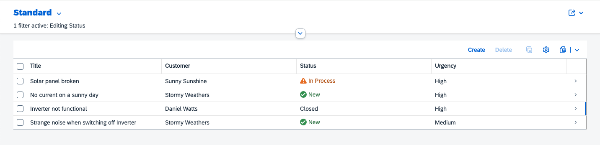

# Exercise 01 - Project Structure, monorepos and git submodules


👉 Initialize a solution repository

```sh
mkdir solution
cd solution
git init
npm init -y
```

This repository serves as the combining root of your solution. We are going to work inside this directory for the rest of the exercises.


👉 Add a `.gitignore`

```
.DS_Store
node_modules
package-lock.json
```


👉 Include the incidents application as a submodule

```sh
git submodule add https://github.com/cap-js/incidents-app incidents
git submodule update --init
```

We now have the full code of the [incidents app](https://github.com/cap-js/incidents-app) in our solution repository.
There's also a `.gitmodules` file managing which repository belongs to which folder as a [git submodule](https://git-scm.com/book/en/v2/Git-Tools-Submodules).

```
solution
├── incidents
│   ├── ...
├── .gitignore
├── .gitmodules
└── package.json
```

Using this setup, one team can work on the incidents-app repository independently. PRs and tests are also kept inside the incidents-app repository. At the same time, another team (we) can work on integrating the incidents-app with the overall solution.

👉 Enable workspaces in the `package.json`:
```json
{
    ...
    "workspaces": ["*"]
}
```

[NPM workspaces](https://docs.npmjs.com/cli/v11/using-npm/workspaces) provide a streamlined workflow for multiple linked npm packages.
In this case, we specify that every root level folder should be considered a workspace, but you can also specify concrete folders like `"workspaces": ["incidents", "utils/.../my-own-lib", ...]`.
It is then possible to reference the other packages as npm dependencies with automatically created symlinks. We will see this in a later exercise.


👉 Install dependencies
```sh
npm i
```

Notice the install location. The `node_modules` folder with dependencies is located inside the `solution` directory instead of `incidents`.
This is because npm workspaces consolidate the dependencies, meaning that you don't have to install them separately for each project.

```
solution
├── incidents
│   ├── _i18n
│   ├── app
│   ├── db
│   ├── LICENSES
│   ├── srv
│   ├── test
│   ├── xmpls
│   ├── cds-plugin.js
│   ├── CONTRIBUTING.md
│   ├── LICENSE
│   ├── package.json
│   ├── readme.md
│   └── REUSE.toml
├── node_modules      <----
│   ├── ...
├── package-lock.json
└── package.json
```


👉 Start the incidents application
```sh
cds w incidents
```

Navigating to http://localhost:4004/incidents/webapp/index.html, you see the familiar incidents app:



## Further reading

- [workspaces and monorepos](https://cap.cloud.sap/docs/guides/deployment/microservices#create-a-solution-monorepo)
- [npm workspaces](https://docs.npmjs.com/cli/v11/using-npm/workspaces)


---

[Next Exercise](../02-add-second-service/)
