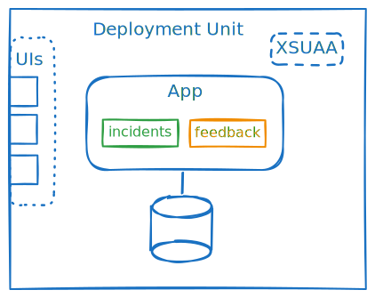

# Exercise 02 - Adding another service


> Continue inside the `solution` folder. If you have a running application, you can stop it.

👉 Initialize a new CAP project
```sh
cds init feedback
npm i # forces npm to recognize the workspace
```

The new project is located parallel to the incidents app. As the new folder is inside `solution`, it is also included as npm workspace due to our `"workspaces": ["*"]` configuration.

```
solution
├── feedback
├── incidents
├── node_modules
├── package-lock.json
└── package.json
```


👉 Add a data model `feedback/db/schema.cds`

```cds
namespace solution.feedback;

using { cuid, User } from '@sap/cds/common';

entity Feedback : cuid {
    subject : String;
    user : User;
    responsiveness : Integer;
    quality : Integer;
    helpfulness : Integer;
    comment : String(200);
}

annotate Feedback with {
    responsiveness @assert.range: [1, 5];
    quality @assert.range: [1, 5];
    helpfulness @assert.range: [1, 5];
};
```

👉 Add incidents as dependency
```sh
npm add --workspace feedback @capire/incidents
```

If you check `feedback/package.json`, you see that incidents was added as a dependency:
```json
  "dependencies": {
    "@capire/incidents": "^1.0.0",
    ...
  }
```

👉 Change the dependency version to a wildcard
```diff
  "dependencies": {
-   "@capire/incidents": "^1.0.0",
+   "@capire/incidents": "*",
    ...
  }
```

This is necessary for the `--ws-pack` of `cds build` which we will see later.

👉 Add a feedback service and connect it to incidents in `feedback/srv/feedback-service.cds`

```cds
using { solution.feedback } from '../db/schema';
using { sap.capire.incidents } from '@capire/incidents/db/schema';

extend feedback.Feedback with {
    incident : Association to incidents.Incidents on $self.subject = incident.ID;
}

service FeedbackService {
    entity Feedback as projection on feedback.Feedback;
    entity Incidents as projection on incidents.Incidents;
}
```


👉 Add a `feedback/.cdsrc.json` with the server port
```json
{ "[development]": {"server": { "port": 4006 } } }
```

This enables you to run the incidents app in parallel to the feedback app.

👉 Start the feedback application
```sh
cds w feedback
```

Navigating to http://localhost:4006, you see the index page listing our OData endpoints.

Note: This also shows the ui app with `cds w` because it is included in the incidents dependency. But as we are not serving the processor service, it does not work. We'll see in the next part of this exercise why it makes sense to see the ui apps of dependencies in local development.

## Run everything together locally

We now construct an easy way to start our whole solution together.

👉 Add an `incidents/index.cds`
```cds
using from './srv/admin-service';
using from './srv/processor-service';
using from './app/services.cds';
```

The index file describes what is included when you import the containing folder or npm package.
In this way, you can control what is exposed when someone uses your package as a dependency.

When we later add the incidents package as a dependency, we can then use the cds

👉 Add an `feedback/index.cds`
```cds
using from './srv/feedback-service';
```


👉 Add both CAP projects as dependencies in our solution repository
```sh
npm add @capire/incidents
npm add feedback
```

Check out the `node_modules` folder. Since we use workspaces, they have been added as symlinks.

```
solution
├─ ...
├─ node_modules
│  ├─ ...
│  ├─ @capire
│  │  └─ incidents -> ../../incidents
│  ├─ ...
│  ├─ feedback -> ../feedback
│  └─ ...
└─ ...
```

This way, we can work in each project and still rely on our changes to be up to date for using them inside our solution repo or the other workspaces.


👉 Add an `srv/index.cds` to use the CDS model of the added dependencies
```cds
using from '@capire/incidents';
using from 'feedback';
```

Here we use everything from `@capire/incidents` (and from `feedback`) as an npm package, meaning the content of `node_modules/@capire/incidents`.
Since this is a folder, the `index.cds` content is read including the processor service, admin service and corresponding ui annotaitons.

With this, we can start the whole solution together as one.

👉 Start the application
```sh
cds w
```

Navigating to http://localhost:4004, we see the server index page listing the service endpoints for both incidents and feedback.
We can also use the incidents ui via this combined application.


As it is running as a single application, but with multiple modules that can be developed independently, this is called a modulith (**modu**les + mono**lith**).



If microservices are not necessary, we can also deploy to the cloud as a single application for reducing costs.
With the modular development, how to deploy is a decision that can be made at a later stage in the development lifecycle -> [late-cut microservices](https://cap.cloud.sap/docs/guides/deployment/microservices#late-cut-microservices).

Since these exercises are about deploying multiple microservices with a shared db, we continue with deploying them separately and only using the modulith for local development.


## Further reading

- [reuse packages](https://cap.cloud.sap/docs/guides/extensibility/composition#import)
- [index.cds entry points](https://cap.cloud.sap/docs/guides/extensibility/composition#index-cds)
