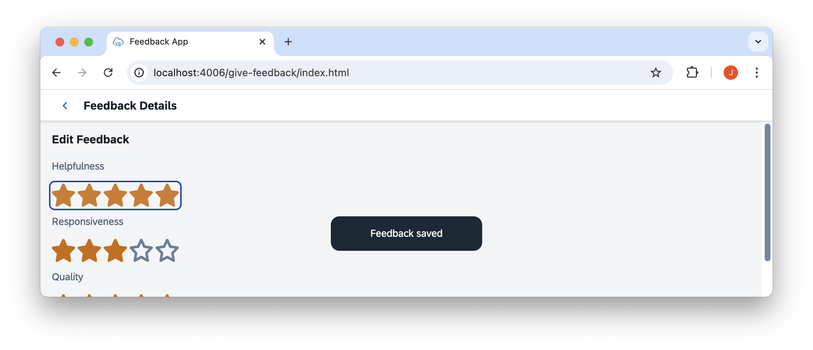

# Exercise 02 - Adding another service


> Continue inside the `solution` folder. If you have a running application, you can stop it.

👉 Initialize a new CAP project
```sh
cds init feedback
```

The new project is located parallel to the incidents app. As the new folder is inside `solution`, it is also included as npm workspace due to our `"workspaces": ["*"]` configuration.

```
solution
├── feedback
├── incidents
├── node_modules
├── package-lock.json
└── package.json
```


👉 Add a data model `feedback/db/schema.cds`

```cds
namespace solution.feedback;

using { cuid, User } from '@sap/cds/common';

entity Feedback : cuid {
    subject : String;
    user : User;
    responsiveness : Integer;
    quality : Integer;
    helpfulness : Integer;
    comment : String(200);
}

annotate Feedback with {
    responsiveness @assert.range: [1, 5];
    quality @assert.range: [1, 5];
    helpfulness @assert.range: [1, 5];
};
```

👉 Add incidents as dependency
```sh
npm add --workspace feedback @capire/incidents
```

If you check `feedback/package.json`, you see that incidents was added as a dependency:
```json
  "dependencies": {
    "@capire/incidents": "^1.0.0",
    ...
  }
```

👉 Change the dependency version to a wildcard
```diff
  "dependencies": {
-   "@capire/incidents": "^1.0.0",
+   "@capire/incidents": "*",
    ...
  }
```

This is necessary for the `--ws-pack` of `cds build` which we will see later.

👉 Add a feedback service and connect it to incidents in `feedback/srv/feedback-service.cds`

```cds
using { solution.feedback } from '../db/schema';
using { sap.capire.incidents } from '@capire/incidents/db/schema';

extend feedback.Feedback with {
    incident : Association to incidents.Incidents on $self.subject = incident.ID;
}

extend incidents.Incidents with {
    feedback : Association to many feedback.Feedback on feedback.incident = $self;
    myFeedback : Association to feedback.Feedback on myFeedback.incident = $self and myFeedback.user = $user;
}

@requires: 'authenticated-user'
service FeedbackService {
    @(restrict: [
        {grant: ['CREATE']},
        {grant: ['READ', 'UPDATE', 'DELETE'], where: 'user = $user'}
    ])
    entity Feedback as projection on feedback.Feedback;

    @readonly
    entity Incidents as projection on incidents.Incidents {
        ID,
        title,
        myFeedback as feedback,
        (myFeedback.quality + myFeedback.helpfulness + myFeedback.responsiveness) / 3 as rating : Integer,
    };
}
```


Our users likely don't want to call the service api directly, but use a nice web application. For a first prototype we use a simple index.html containing our full SAP UI5 app. We vibe code a little to get a working version, but this still needs to be overhauled by our UI team.


👉 Add a `feedback/app/give-feedback/index.html`

<details>

<summary>`index.html` content</summary>


```html
<!-- Warning: Do not refer to this file as an example to be used for UI5 application development.
              Instead, refer to proper SAP UI5 example applications.
-->
<!DOCTYPE html>
<html>

<head>
    <meta charset="UTF-8" />
    <title>Feedback App</title>
    <script id="sap-ui-bootstrap" src="https://sdk.openui5.org/resources/sap-ui-core.js" data-sap-ui-theme="sap_horizon"
        data-sap-ui-libs="sap.m" data-sap-ui-async="true" data-sap-ui-compatVersion="edge"></script>

    <script>
        // Create reusable rating input bound to a field in Feedback entity
        function createEditableRating(bindingPath) {
            return new sap.m.VBox({
                items: [
                    new sap.m.Label({
                        text: { path: `$meta>${bindingPath}@com.sap.vocabularies.Common.v1.Label` }
                    }),
                    new sap.m.RatingIndicator({
                        value: { path: bindingPath },
                        maxValue: 5,
                        iconSize: "2rem",
                        change: async function (oEvent) {
                            const oSource = oEvent.getSource();
                            const oBinding = oSource.getBinding("value");
                            const sField = oBinding.getPath();
                            const oContext = oBinding.getContext();

                            if (!oContext || !oContext.getObject()) {
                                // Feedback doesn't exist yet — create on demand

                                // Revisit: use hash based navigation and take the incident id from the hash
                                const oVBox = sap.ui.getCore().byId("detailsVBox");
                                const oIncidentCtx = oVBox.data("incidentCtx");

                                const oModel = oIncidentCtx.getModel();
                                const oIncidentData = oIncidentCtx.getObject();

                                try {
                                    // 1. Create Feedback entity
                                    const oNewCtx = await oModel.bindList("/Feedback").create({
                                        subject: oIncidentData.ID,
                                        [sField]: oEvent.getParameter("value")
                                    }, {
                                        groupId: "$auto"
                                    });

                                    // 2. Set new binding contexts
                                    oVBox.setBindingContext(oNewCtx);
                                    const oMetaModel = oModel.getMetaModel();
                                    oVBox.setBindingContext(oMetaModel.getMetaContext(oNewCtx.getPath()), "$meta");

                                    // 3. Submit the batch
                                    await oModel.submitBatch("$auto");

                                    // 4. Refresh the list view
                                    const oList = sap.ui.getCore().byId("incidentList");
                                    oList?.getBinding("items")?.refresh();

                                    sap.m.MessageToast.show("Feedback created and saved");
                                } catch (err) {
                                    console.error("Failed to create Feedback:", err);
                                    sap.m.MessageToast.show("Error saving feedback");
                                }
                            } else {
                                // Feedback exists — just update
                                const oModel = oContext.getModel();
                                const sGroupId = oBinding.getUpdateGroupId?.() || "$auto";

                                try {
                                    await oModel.submitBatch(sGroupId);

                                    const oList = sap.ui.getCore().byId("incidentList");
                                    oList?.getBinding("items")?.refresh();

                                    sap.m.MessageToast.show("Feedback saved");
                                } catch (err) {
                                    console.error("Failed to save feedback:", err);
                                    sap.m.MessageToast.show("Error saving feedback");
                                }
                            }
                        },
                    })
                ]
            });
        }

        sap.ui.getCore().attachInit(function () {
            const oModel = new sap.ui.model.odata.v4.ODataModel({
                serviceUrl: "/odata/v4/feedback/"
            });
            sap.ui.getCore().setModel(oModel);

            const oApp = new sap.m.App("myApp");

            // Incident List Page
            const oListPage = new sap.m.Page({
                title: "Incident Feedback",
                content: [
                    new sap.m.List("incidentList", {
                        headerText: "Incidents",
                        mode: "SingleSelectMaster",
                        itemPress: function (oEvent) {
                            const oCtx = oEvent.getParameter("listItem").getBindingContext();
                            const oModel = sap.ui.getCore().getModel();
                            const feedbackPath = oCtx.getPath() + "/feedback";

                            // Create OData V4 binding
                            const oBinding = oModel.bindContext(feedbackPath);

                            oBinding.requestObject().then(() => {
                                const feedbackContext = oBinding.getBoundContext();
                                const oVBox = sap.ui.getCore().byId("detailsVBox");
                                const oMetaModel = oModel.getMetaModel();
                                const oMetaCtx = oMetaModel.getMetaContext(feedbackContext.getPath());

                                oVBox.setBindingContext(oMetaCtx, "$meta");     // meta context
                                oVBox.setModel(oMetaModel, "$meta");            // meta model
                                oVBox.setBindingContext(feedbackContext);       // data context
                                oVBox.setModel(oModel);                         // default model

                                oVBox.data("incidentCtx", oCtx); // store for later
                                sap.ui.getCore().byId("myApp").to("detailsPage");
                            }).catch((err) => {
                                sap.m.MessageToast.show("Failed to load Feedback.");
                                console.error("Feedback load error:", err);
                            });
                        },
                        items: {
                            path: "/Incidents",
                            template: new sap.m.CustomListItem({
                                type: "Active",
                                content: new sap.m.HBox({
                                    justifyContent: "SpaceBetween",
                                    width: "100%",
                                    items: [
                                        new sap.m.Text({ text: "{title}" }),
                                        new sap.m.RatingIndicator({
                                            value: "{rating}",
                                            maxValue: 5,
                                            iconSize: "1.5rem",
                                            enabled: false
                                        })
                                    ]
                                })
                            })
                        }
                    })
                ]
            });

            // Feedback Details Page
            const oDetailsVBox = new sap.m.VBox("detailsVBox", {
                items: [
                    new sap.m.Title({ text: "Edit Feedback" }).addStyleClass("sapUiSmallMarginBottom"),
                    createEditableRating("helpfulness"),
                    createEditableRating("responsiveness"),
                    createEditableRating("quality")
                ]
            }).addStyleClass("sapUiSmallMargin");

            const oDetailsPage = new sap.m.Page("detailsPage", {
                title: "Feedback Details",
                showNavButton: true,
                navButtonPress: function () {
                    oApp.back();
                },
                content: [oDetailsVBox]
            });

            oApp.addPage(oListPage).addPage(oDetailsPage).placeAt("content");
        });
    </script>
</head>

<body class="sapUiBody" id="content">
    <div id="app"></div>
</body>

</html>
```

</details>


👉 Add a `feedback/.cdsrc.json` with the server port
```json
{ "[development]": {"server": { "port": 4006 } } }
```

This enables you to run the incidents app in parallel to the feedback app.

👉 Start the feedback application
```sh
cds w feedback
```

Navigating to http://localhost:4006, you see the index page listing our OData endpoints.

Note: This also shows the ui app with `cds w` because it is included in the incidents dependency. But as we are not serving the processor service, it does not work. We'll see in the next part of this exercise why it makes sense to see the ui apps of dependencies in local development.


👉 Go to http://localhost:4006/give-feedback/index.html, select one of the incidents and give some feedback



After you give feedback for all categories, you can reload the page to see the list again with an updated rating. We really need to give this to our UI experts for improvements...

> Btw, you can give feedback for re>≡CAP through [this survey](https://url.sap/6rouc7).

## Run everything together locally

We now construct an easy way to start our whole solution together.

👉 Add an `incidents/index.cds`
```cds
using from './srv/admin-service';
using from './srv/processor-service';
using from './app/services.cds'
```

The index file describes what is included when you import the containing folder or npm package.
In this way, you can control what is exposed when someone uses your package as a dependency.

When we later add the incidents package as a dependency, we can then use the cds

👉 Add an `feedback/index.cds`
```cds
using from './srv/feedback-service';
```


👉 Add both CAP projects as dependencies in our solution repository
```sh
npm add @capire/incidents
npm add feedback
```

Check out the `node_modules` folder. Since we use workspaces, they have been added as symlinks.

```
solution
├─ ...
├─ node_modules
│  ├─ ...
│  ├─ @capire
│  │  └─ incidents -> ../../incidents
│  ├─ ...
│  ├─ feedback -> ../feedback
│  └─ ...
└─ ...
```

This way, we can work in each project and still rely on our changes to be up to date for using them inside our solution repo or the other workspaces.


👉 Add an `srv/index.cds` to use the CDS model of the added dependencies
```cds
using from '@capire/incidents';
using from 'feedback';
```

Here we use everything from `@capire/incidents` (and from `feedback`) as an npm package, meaning the content of `node_modules/@capire/incidents`.
Since this is a folder, the `index.cds` content is read including the processor service, admin service and corresponding ui annotaitons.

With this, we can start the whole solution together as one.

👉 Start the application
```sh
cds w
```

Navigating to http://localhost:4004, we see the server index page listing the service endpoints for both incidents and feedback.
We can also use the incidents and feedback uis via this combined application.
The incidents ui already has the necessary registration, for feedback we still need to add it.

👉 Add a `feedback/cds-plugin.js`

```js
const cds = require("@sap/cds")
cds.once('bootstrap', (app) => {
  app.serve('/give-feedback').from(__dirname,'/app/give-feedback')
})
```

👉 Try out the application interactions


As it is running as a single application, but with multiple modules that can be developed independently, this is called a modulith (**modu**les + mono**lith**).


If microservices are not necessary, we can also deploy to the cloud as a single application for reducing costs.
With the modular development, how to deploy is a decision that can be made at a later stage in the development lifecycle -> [late-cut microservices](https://cap.cloud.sap/docs/guides/deployment/microservices#late-cut-microservices).

Since these exercises are about deploying multiple microservices with a shared db, we continue with deploying them separately and only using the modulith for local development.


## Further reading

- [reuse packages](https://cap.cloud.sap/docs/guides/extensibility/composition#import)
- [index.cds entry points](https://cap.cloud.sap/docs/guides/extensibility/composition#index-cds)
