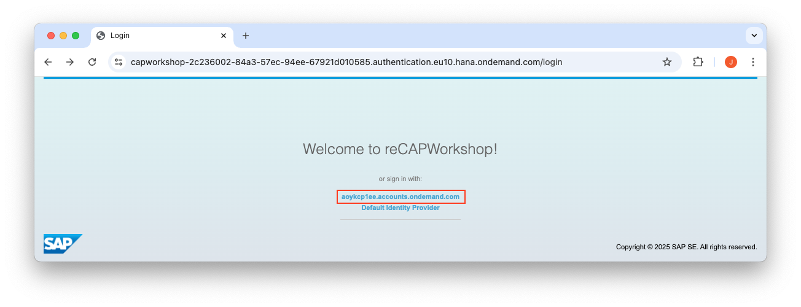
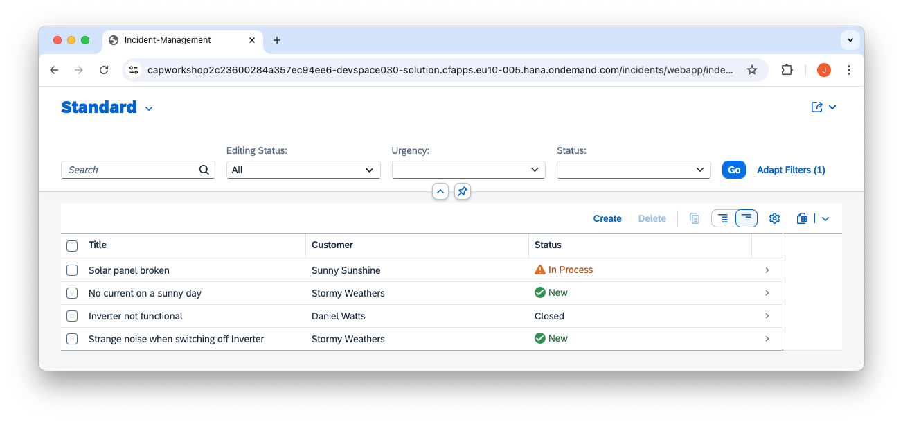
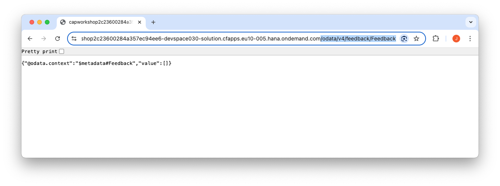
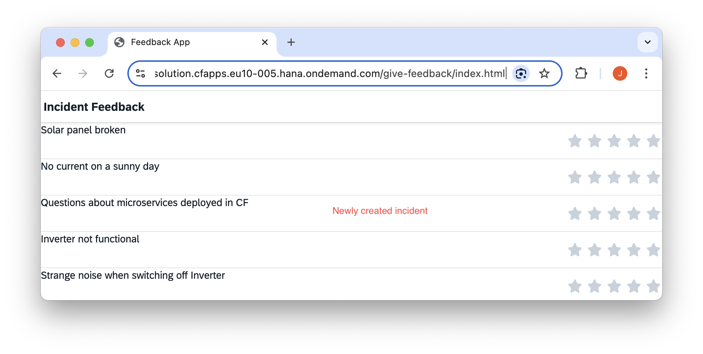

# Exercise 05 - Deploy the application


👉 Log in to Cloud Foundry

For [re>≡CAP 2025](https://recap-conf.dev/), you can use the prepared Cloud Foundry environment.

```sh
cf l -a https://api.cf.eu10-005.hana.ondemand.com --origin aoykcp1ee-platform
```

User: capworkshopuser+0xx@gmail.com (001 ... 040 is the range)  
Password: *** (shared in Workshop)

> If you work through this on your own, login via `cf login --sso` in a BTP trial account.

👉 Deploy the application
```sh
cds up
```

This command includes multiple steps like `mbt build` and `cf deploy`. You can learn more in the [deploy documentation](https://cap.cloud.sap/docs/guides/deployment/to-cf#build-and-deploy).

Checking the command output, we see the executed steps in blue.

First the mbt build

```sh
$ cds up

mbt build -t gen --mtar mta.tar
[2025-07-08 13:49:40]  INFO Cloud MTA Build Tool version 1.2.34
...
[2025-07-08 13:49:40]  INFO running the "before-all" build...
[2025-07-08 13:49:40]  INFO executing the "npm ci" command...
...
[2025-07-08 13:49:48]  INFO executing the "npx cds build ./shared-db --for hana --production --ws-pack" command...
...
[2025-07-08 13:49:49]  INFO executing the "npx cds build ./incidents --for nodejs --production --ws-pack" command...
...
[2025-07-08 13:49:51]  INFO executing the "npx cds build ./feedback --for nodejs --production --ws-pack" command...
...
[2025-07-08 13:49:53]  INFO building the "incidents-srv" module...
...
[2025-07-08 13:49:59]  INFO building the "feedback-srv" module...
...
[2025-07-08 13:50:01]  INFO building the "solution-db-deployer" module...
...
[2025-07-08 13:50:03]  INFO building the "solution" module...
...
[2025-07-08 13:50:16]  INFO generating the MTA archive...
[2025-07-08 13:50:16]  INFO the MTA archive generated at: gen/mta.tar
...
```

This includes our custom `before-all` build steps. We should see the output of the build inside each gen folder:

```
solution
├── app
│   └── router
├── feedback
│   ├── app
│   ├── db
│   ├── gen     <---
│   └── srv
├── gen
│   └── mta.tar
├── incidents
│   ├── app
│   ├── db
│   ├── gen     <---
│   ├── _i18n
│   ├── LICENSES
│   ├── srv
│   ├── test
│   └── xmpls
├── node_modules
├── shared-db
│   ├── app
│   ├── db
│   ├── gen     <---
│   └── srv
└── srv
```

The result of the build is an `mta.tar` file which contains all our coding, files and configuration needed for deployment. As it is a tar file, you can also unpack it and look what's inside.

The next step is `cf deploy`

```sh
$ cds up

...

cf deploy gen/mta.tar -f
Deploying multi-target app archive gen/mta.tar in org capworkshop2c23600284a357ec94ee6 / space devspace030 as capworkshopuser+030@gmail.com...

Uploading 1 files...
  /workspaces/cap-microservices-workshop/solution/gen/mta.tar
 4s  14.63 MiB / 14.63 MiB [====================================================================================================================================] 100.00% 4s
OK
Operation ID: ba35814a-5bf1-11f0-ae69-eeee0a8ca141
Deploying in org "capworkshop2c23600284a357ec94ee6" and space "devspace030"
...
Processing service "solution-auth"...
...
Processing service "solution-db"...
...
Creating application "incidents-srv" from MTA module "incidents-srv"...
...
Creating application "solution" from MTA module "solution"...
...
Creating application "feedback-srv" from MTA module "feedback-srv"...
...
Application "solution" started and available at "capworkshop2c23600284a357ec94ee6-devspace030-solution.cfapps.eu10-005.hana.ondemand.com"
...
Process finished.
...
```

This uploads the `mta.tar` to Cloud Foundry, where the [multiapps controller](https://github.com/cloudfoundry/multiapps-controller) takes over and creates the service instances and applications based on what we defined in the `mta.yaml`.


👉 Check the mta deployment
```sh
cf mta solution
```


We see both our incidents and our feedback app as microservices.

```
Showing health and status for multi-target app solution in org capworkshop04d54673f74b766d0c331 / space jv as j.vogt@sap.com...
OK
Version: 1.0.0
Namespace: 

Apps:
name                   requested state   instances   memory   disk     urls
solution-db-deployer   STOPPED           0/1         0        0
incidents-srv          STARTED           1/1         72.3M    209.8M   capworkshop04d54673f74b766d0c331-jv-incidents-srv.cfapps.eu10.hana.ondemand.com
solution               STARTED           1/1         63.6M    231.3M   capworkshop04d54673f74b766d0c331-jv-solution.cfapps.eu10.hana.ondemand.com
feedback-srv           STARTED           1/1         71.7M    211.4M   capworkshop04d54673f74b766d0c331-jv-feedback-srv.cfapps.eu10.hana.ondemand.com

Services:
name            service   plan          bound apps                                          last operation
solution-db     hana      hdi-shared    solution-db-deployer, incidents-srv, feedback-srv   create succeeded
solution-auth   xsuaa     application   solution, incidents-srv, feedback-srv               create succeeded
```

Alternatively, you can also see the apps or services using `cf services` and `cf apps`.

👉 Visit the `solution` app

The url - or rather, the domain - is given as part of the output of the `cf apps` or `cf app solution` commands. It should look like this `<org>-<space>-solution.cfapps.eu10.hana.ondemand.com`. Copy this domain and paste it into your borwser.

> When using the provided Cloud Foundry space during [re>≡CAP 2025](https://recap-conf.dev/), you may be prompted on how to sign in. Choose `aoykcp1ee.accounts.ondemand.com`.
> 

You should now be redirected to the `incidents/webapp/index.html` page. Remember that this is the `welcomeFile` we set inside the `xs-app.json` in the previous exercise.




Since approuter acts as a proxy, we can also view the odata endpoints exposed by our applications. Visit the feedback odata endpoint by entering the path `/odata/v4/feedback/Feedback` after the domain.



👉 Try out the application interactions

Just like in exercise 02 when running both applications together on the local system, create an incident in the application at `/incidents/webapp/index.html`.

The incident then also appears in the feedback application at `/give-feedback/index.html`.



---

This was the final exercise.

A [re>≡CAP 2025 survey](https://url.sap/6rouc7) is available for CAP developers - please take a moment to complete it if you can. Thank you! 
